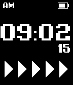
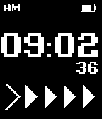
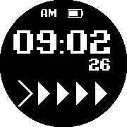
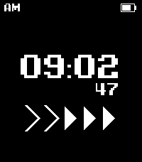
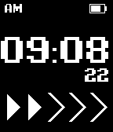

# Digivice Watchface for Pebble

A clean, retro digital watchface inspired by the classic 1997 Bandai Digimon Digivice virtual pet, built for Pebble smartwatches on the Rebble SDK.

---

## Screenshots & Supported Platforms

| Platform | Codename | Display Specs | Screenshot |
| :--- | :---: | :--- | :---: |
| **Pebble Time / Time Steel** | `basalt` | 144 × 168 &bull; 64-Color |  |
| **Pebble 2 / 2 SE** | `diorite` | 144 × 168 &bull; Monochrome |  |
| **Pebble Time Round** | `chalk` | 180 × 180 &bull; Circular 64-Color |  |
| **Pebble Time 2** | `emery` | 200 × 228 &bull; 64-Color |  |
| **Pebble Classic / Steel** | `aplite` | 144 × 168 &bull; Monochrome |  |

---

## Features

- **Retro Digivice Typography**: Custom pixelated digital clock face using the authentic Digivolve font.
- **Dynamic Arrow Progression**: 5 animated chevrons dynamically track 10-second intervals across every minute:
  - Open chevrons rendered via mathematical 1:1 diagonal vector strokes (`GPath`) to completely eliminate aliasing.
  - Solid filled triangles fill sequentially as seconds elapse.
- **Top Status Bar**:
  - Persistent **AM / PM** indicator shown across all locales and time styles.
  - Integrated **battery meter** with fill percentage and active charging indicator.
- **Responsive Multi-Platform Layout**:
  - Automatically adapts to both rectangular displays (Pebble Time, Pebble 2, Pebble Time 2) and circular displays (Pebble Time Round), ensuring all UI elements remain comfortably within the viewport.
- **Lightweight & Efficient**: Zero extraneous bitmaps; all chevrons and battery icons are drawn procedurally via low-overhead Pebble vector graphics primitives.

---

## Building from Source

### Prerequisites
- [Pebble SDK / pebble-tool](https://rebble.io/howto/) installed (via Rebble's modern toolchain).
- Python 3 environment.

### Build
To clean and compile the bundle for all supported platforms:
```bash
pebble clean
pebble build
```
The compiled bundle will be output to:
```
build/digivice-watchface.pbw
```

### Install
- **Via Emulator**:
  ```bash
  pebble install --emulator basalt
  ```
- **Via Physical Pebble (over Wi-Fi developer connection)**:
  1. Open the Pebble app on your phone and enable the Developer Connection under Settings.
  2. Run:
     ```bash
     pebble install --phone <PHONE_IP_ADDRESS>
     ```

---

## Publishing to Rebble Appstore

1. Log in to the [Rebble Developer Portal](https://dev-portal.rebble.io/).
2. Create a new **Watchface**.
3. Upload `build/digivice-watchface.pbw`.
4. Upload the corresponding screenshots from the [`store_assets/`](store_assets/) folder for each platform.

---

## License

This project is licensed under the [MIT License](LICENSE).
